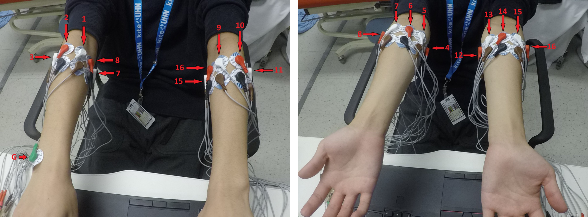

# KeypressEMG


  

- [Overview](#overview)
- [Dataset Description](#dataset-description)
- [Directory Structure](#directory-structure)
- [Installation](#installation)
- [Data Preparation Process](#data-preparation-process)
- [Classification Baselines](#classification-baselines)
  
## Link to full dataset
[Electromyographic typing gesture classification dataset
for neurotechnological human-machine interfaces](link)

## Overview
Code and sample participant for dataset containing sEMG data for every alphabetical letter collected from 19
participants across 2 days of testing. The full dataset is provided [here](https://borealisdata.ca/dataset.xhtml?persistentId=doi:10.5683/SP3/KV65VI).


## Dataset Description
19 able-bodied participants were instrumented with 16 channels of sEMG,
8 channels per arm, placed in a circular arrangement on their upper forearm.
Participants are labelled from **P1-P19**.

Two sessions on different days were conducted for each participant.
During each session participants performed two recordings for each letter,
where each key was pressed at a steady rate based off a metronome. 
In each recording the space bar was pressed 5 times followed by 10 presses 
of a single alphabetical key. 

Labelling was done using a keylog that was recorded along with the sEMG data.
Alignment between the keylog and sEMG data was performed between the keylogger 
data and the sEMG data. Both the original key-logs and the csv containing the lag 
timing data between the sEMG and the keylogger data is included with the dataset.

## Directory Structure
Full participant directory can be found in the provided link. A sample participant (P1) is included in the CleanData folder here. The directory structure for the CleanData folder is provided below.
```
CleanData/
	P1-20/
		T1/
			keylogs.txt
			LAG_TIMINGS.csv
			Data/
				A_....rhd
				A_....rhd
				B_....rhd
				B_....rhd
				C_....rhd
				.
				.
				.

		T2/...
```
### File Count
An overview of the number of files in each participants dataset for each test day.

A complete list of the number of key presses for each trial is included in the csv file press_counts.csv.
We can see that there are some tests that are missing 1-3 recordings. 
This is due either to errors in collection leading to stoppage in the 
recording before the end of the trial or to a keylog error not detecting the 
space bar key preses to indicate the start of a trial.

Any warnings or errors generated during data sorting are included in Warnings.csv.

```
P1; T1: Number of Files: 52
P1; T2: Number of Files: 52
P2; T1: Number of Files: 52
P2; T2: Number of Files: 52
P3; T1: Number of Files: 52
P3; T2: Number of Files: 52
P4; T1: Number of Files: 52
P4; T2: Number of Files: 52
P5; T1: Number of Files: 50
P5; T2: Number of Files: 52
P6; T1: Number of Files: 52
P6; T2: Number of Files: 52
P7; T1: Number of Files: 52
P7; T2: Number of Files: 52
P8; T1: Number of Files: 52
P8; T2: Number of Files: 52
P9; T1: Number of Files: 52
P9; T2: Number of Files: 52
P10; T1: Number of Files: 52
P10; T2: Number of Files: 52
P12; T1: Number of Files: 51
P12; T2: Number of Files: 49
P13; T1: Number of Files: 52
P13; T2: Number of Files: 51
P14; T1: Number of Files: 52
P14; T2: Number of Files: 52
P15; T1: Number of Files: 52
P15; T2: Number of Files: 52
P16; T1: Number of Files: 52
P16; T2: Number of Files: 52
P17; T1: Number of Files: 52
P17; T2: Number of Files: 52
P18; T1: Number of Files: 52
P18; T2: Number of Files: 52
P19; T1: Number of Files: 52
P19; T2: Number of Files: 51
P20; T1: Number of Files: 52
P20; T2: Number of Files: 52

```

## Installation
Clone the repository - This will also download the sample P1 data recording. 
```
git clone https://github.com/ANSLab-UHN/sEMG-TypingDatabase.git 
```
Next download full dataset from [link](https://borealisdata.ca/dataset.xhtml?persistentId=doi:10.5683/SP3/KV65VI) and move the full dataset to the CleanData folder in the downloaded repository.

* Change directory to the cloned folder
```angular2html
cd sEMG-TypingDatabase
```
### Install Using Bash Scripts
Install dependencies inside a virtual environment
using one the bash scripts:
```angular2html
bash install.sh
```
or if you have [Poetry](https://python-poetry.org/docs/) installed:
```angular2html
bash install_using_poetry.sh
```
### Manual Install
Install dependencies inside a virtual environment
```angular2html
python -m venv .venv
```
```angular2html
source venv/bin/activate
```
```angular2html
pip install -e .
```
or alternatively, if [Poetry](https://python-poetry.org/docs/) is used
```
poetry shell
```
```angular2html
poetry install
```

## Data Preparation Process
### tl;dr
KeypressEMG folder contains a script called `prepare_data.sh`.
Run the script:
```
bash data_prpare.sh
```
and go grab a cup of coffee. 


### Data Preparation Steps


`data_prepare.sh` runs the following 4 python modules
(that you can also run manually):
```angular2html
python -m keypressemg.data_prep.validate
```
```angular2html
python -m keypressemg.data_prep.slice
```
```angular2html
python -m keypressemg.data_prep.extract
```
```angular2html
python -m keypressemg.data_prep.user_features
```

that create the following corresponding folders:
```angular2html
CleanData/
    valid_experiments/
    valid_windows/
    valid_features/
    valid_user_features/
```

The last 3 folders contain `.npy` files of numpy arrays
of signal windows and calculated features of windows and per user features respectively. 
The `valid_experiments` folder contains an `.npy` file for each validated `.rhd` file in the recordings.
Each file contains the relevant data from the corresponding recording.

### Data Preparation Detailed Explanation
#### Validation and Slicing - Create Pi_Tj Labeled Raw Signal Windows
`CleanData/valid_windows` is a folder of numpy arrays stored in npy files. 
Each experiment day of a user is represented by a pair of files.
For example the second experiment day of the first participant is stored in:
```angular2html
P1_T2_X.npy
P1_T2_y.npy
```
The first file contains an array of shape (520, 16, 400) which relates
to 520 16-channel signal windows where each window last 400 timestamps (=0.2 sec).
The second file contains an array of shape (520,), which relates
to the corresponding true labels of each window.

**Note:** Some arrays may contain less than 520 windows.

Produce this folder by:
```angular2html
python -m keypressemg.data_prep.validate
python -m keypressemg.data_prep.slice
```
The first command will go over all experiments recordings, 
preform a validation process and keep the validated signals in `CleanData/valid_experiments`.

The second command then slice each validated file to 0.2 second
windows centered at a key press. These windows are stored in `CleanData/valid_windows`.
#### Feature Vectors of Windows
##### Feature Extraction
Calculate high level features of each window and prepare a folder of
numpy arrays stored in npy files.
The features that are calculated are:
* RMS - Root mean squared.
* LOGVAR - Log of variance.
* WL - Sum of absolute differences between timestamps
* WAMP - Count number of timestamps that their difference
from the previous timestamp is more than a given threshold.
* AR1 and AR2 - Autoregressive model of lags 1 and 2.
All features are calculated per channel to produce a feature vector of shape (96,).

Each feature vector is stored in a file and all these files are stored in `CleanData/valid_features`.

Produce this folder by:
```angular2html
python -m keypressemg.data_prep.extract
```
##### Aggregate User Features
The final file organization step is accumulating all feature vectors relevant to a certain participant in 4 files
named: 
```
P1_T1_X.npy
P1_T1_y.npy
P1_T2_X.npy
P1_T2_y.npy 
```
for participant 1 e.g.
All these files are stored in a folder named `valid_user_windows`.

Produce this folder by:
```angular2html
python -m keypressemg.data_prep.user_features
```

## Classification Baselines
### Split Day Data for Participant

#### SVM Classification
```angular2html
python -m keypressemg.trainers.train_svm_split_day
```
#### MLP Classification
```angular2html
python -m keypressemg.trainers.train_mlp_split_day

```
### Train on First Day - Eval on other

#### SVM Classification
```angular2html
python -m keypressemg.trainers.train_svm_between_days
```
#### MLP Classification
```angular2html
python -m keypressemg.trainers.train_mlp_between_days
```
